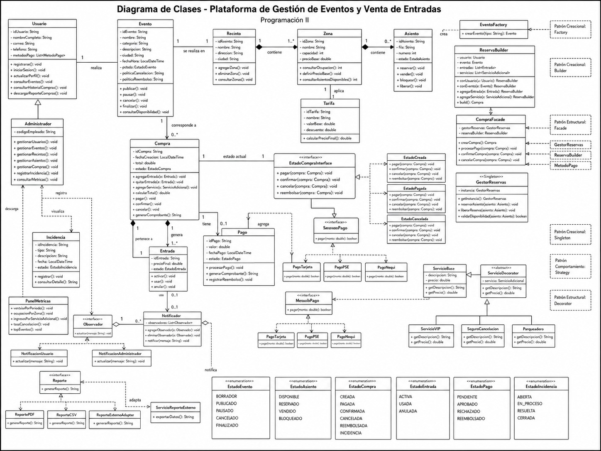

```markdown
# PENSAMIENTO COMPUTACIONAL RF-043

## Plataforma de Gestión de Eventos y Venta de Entradas
 
Programación II - Universidad del Quindío

Juan José Téllez Sánchez, Sofia Avilés Díaz y Mariana Rodriguez Maya



---

# 1. Pensamiento Computacional

## 1.1 ¿Qué se solicita finalmente?

Se solicita diseñar, antes de programar, una plataforma orientada a objetos para gestionar eventos y vender entradas. El sistema debe permitir que un usuario consulte eventos, revise disponibilidad, seleccione entradas, realice una compra, pague de forma simulada y reciba notificaciones sobre cambios importantes.

También se debe permitir que un administrador gestione eventos, recintos, zonas, asientos, incidencias y métricas. Por eso el objetivo no es solo vender entradas, sino dejar bien organizado el diseño del sistema antes de pasar a Java.

---

## 1.2 ¿Qué información es relevante?

| Información relevante | Por qué importa |
|---|---|
| Usuarios y administradores | Permiten separar quién compra entradas y quién administra la plataforma. |
| Eventos | Son el producto principal que se ofrece en el sistema. |
| Recintos, zonas y asientos | Permiten organizar la ubicación y disponibilidad para cada evento. |
| Compras y entradas | Representan el proceso de venta y el acceso que recibe el usuario. |
| Pagos y métodos de pago | Permiten simular el pago usando diferentes opciones como tarjeta, PSE o Nequi. |
| Tarifas y servicios adicionales | Ayudan a calcular el valor final de la compra. |
| Incidencias, reportes y métricas | Sirven para que el administrador revise problemas y resultados del sistema. |

---

## 1.3 ¿Cómo se agrupa la información relevante? (clases y estructura)

La información se agrupa en clases. Cada clase representa una parte importante del sistema y tiene una responsabilidad clara. Esta organización es la misma que se muestra en el diagrama UML.

| Grupo | Clases principales | Responsabilidad |
|---|---|---|
| Usuarios | Usuario, Administrador | Manejar el acceso al sistema y las acciones según el tipo de usuario. |
| Eventos y espacios | Evento, Recinto, Zona, Asiento, Tarifa | Organizar los eventos, el lugar donde se realizan, sus zonas, asientos y precios. |
| Ventas | Compra, Entrada, Pago | Controlar la compra, las entradas generadas y el pago asociado. |
| Servicios extra | ServicioAdicional, ServicioBase, ServicioDecorator, ServicioVIP, SeguroCancelacion, Parqueadero | Agregar beneficios o servicios adicionales a una compra. |
| Notificaciones | Notificador, Observador, NotificacionUsuario, NotificacionAdministrador | Avisar cuando una compra o evento cambia. |
| Reportes | Reporte, ReportePDF, ReporteCSV, ReporteExternoAdapter | Generar reportes o adaptar reportes externos. |
| Estados | EstadoCompraInterface y estados concretos | Controlar el comportamiento de una compra según su estado. |
| Administración | Incidencia, PanelMetricas | Registrar problemas y consultar información de ventas u ocupación. |

---

## 1.4 ¿Qué funcionalidades se solicitan?

- Registrar e iniciar sesión de usuarios.
- Consultar eventos disponibles y su información principal.
- Gestionar eventos, recintos, zonas y asientos desde el rol administrador.
- Crear compras con una o varias entradas.
- Calcular el total de una compra, incluyendo tarifas y servicios adicionales.
- Procesar pagos simulados con diferentes métodos de pago.
- Cambiar el estado de una compra según el proceso.
- Notificar cambios importantes a usuarios o administradores.
- Registrar incidencias y consultar métricas o reportes.

---

## 1.5 ¿Cómo se distribuyen las funcionalidades?

| Funcionalidad | Clase o grupo responsable |
|---|---|
| Registro, login y consulta de compras | Usuario |
| Gestión de eventos, recintos y asientos | Administrador, Evento, Recinto, Zona, Asiento |
| Proceso de compra | Compra, Entrada, ReservaBuilder, CompraFacade |
| Pago simulado | Pago, MetodoPago, PagoTarjeta, PagoPSE, PagoNequi |
| Servicios adicionales | ServicioAdicional, ServicioDecorator y sus clases hijas |
| Cambios de estado de compra | EstadoCompraInterface y estados concretos |
| Notificaciones | Notificador y Observador |
| Reportes y métricas | Reporte, ReportePDF, ReporteCSV, ReporteExternoAdapter, PanelMetricas |
| Incidencias | Incidencia |

---

## 1.6 ¿Qué debo hacer para probar las funcionalidades?

| Prueba | Qué se valida |
|---|---|
| Registro de usuario | Crear un usuario con datos válidos y verificar que quede registrado. |
| Consulta de eventos | Listar eventos publicados y revisar que la información sea correcta. |
| Creación de evento | Crear un evento con recinto, zonas y asientos asociados. |
| Compra con entradas | Crear una compra y comprobar que genere una o varias entradas. |
| Pago simulado | Procesar un pago con tarjeta, PSE o Nequi y validar el resultado. |
| Servicios adicionales | Agregar VIP, parqueadero o seguro y verificar que cambie el total. |
| Cambio de estado | Pasar una compra por estados como creada, pagada, confirmada o cancelada. |
| Notificación | Cambiar una compra o evento y comprobar que se llame al notificador. |
| Incidencia y reporte | Registrar una incidencia y generar un reporte simple. |

---

## 1.7 ¿Qué puedo reutilizar?

Se pueden reutilizar clases, interfaces y patrones para evitar repetir lógica. Por ejemplo, todos los métodos de pago usan la interfaz `MetodoPago`; todos los reportes usan la interfaz `Reporte`; y los servicios adicionales se agregan por medio de `ServicioAdicional`.

### Interfaces reutilizables

- MetodoPago
- ServicioAdicional
- Observador
- Reporte
- EstadoCompraInterface

### Clases de soporte reutilizables

- GestorReservas
- ReservaBuilder
- CompraFacade
- EventoFactory

### Patrones reutilizables

- Singleton
- Factory
- Builder
- Decorator
- Facade
- Adapter
- Strategy
- Observer
- State

### Enumeraciones reutilizables

- EstadoEvento
- EstadoAsiento
- EstadoCompra
- EstadoEntrada
- EstadoPago
- EstadoIncidencia

---

## 1.8 ¿Cómo pruebo/escribo la solución en Java?

La solución se puede escribir en Java creando primero las clases principales del diagrama y después agregando los patrones. Para probarla no es necesario tener toda la interfaz gráfica; se pueden hacer pruebas unitarias sencillas o pruebas desde una clase `Main`.

| Paso en Java | Ejemplo de prueba sencilla |
|---|---|
| Crear las entidades | Instanciar Usuario, Evento, Recinto, Zona, Asiento y Compra. |
| Probar asociaciones | Verificar que una Compra tenga Usuario, Evento, Entrada y Pago. |
| Probar Strategy | Cambiar MetodoPago entre PagoTarjeta, PagoPSE y PagoNequi. |
| Probar Decorator | Agregar ServicioVIP o Parqueadero y revisar el precio final. |
| Probar State | Cambiar el estado de Compra y validar qué acciones permite. |
| Probar Observer | Registrar observadores y comprobar que reciban una notificación. |
| Probar Adapter | Generar un reporte usando ReporteExternoAdapter. |

---

# 2. Diagrama UML de Clases (RF-044)

El diagrama incluye las entidades principales del sistema y las clases de soporte donde se aplican los patrones de diseño. También muestra relaciones, multiplicidades, atributos y métodos principales.

## 2.1 Entidades y clases de soporte incluidas

| Tipo | Clases incluidas |
|---|---|
| Entidades del sistema | Usuario, Evento, Recinto, Zona, Asiento, Compra, Entrada, Pago, Tarifa e Incidencia. |
| Clases de soporte | GestorReservas, EventoFactory, ReservaBuilder, CompraFacade, PanelMetricas, Notificador y reportes. |
| Interfaces | MetodoPago, ServicioAdicional, Observador, Reporte y EstadoCompraInterface. |
| Enumeraciones | EstadoEvento, EstadoAsiento, EstadoCompra, EstadoEntrada, EstadoPago y EstadoIncidencia. |

---

## 2.2 Relaciones principales del UML

| Relación | Tipo | Explicación sencilla |
|---|---|---|
| Administrador hereda de Usuario | Herencia | El administrador también es usuario, pero tiene más permisos. |
| Usuario realiza Compra | Asociación | Un usuario puede realizar varias compras. |
| Evento se realiza en Recinto | Asociación | Cada evento necesita un lugar donde realizarse. |
| Recinto contiene Zona | Composición | Las zonas hacen parte del recinto. |
| Zona contiene Asiento | Composición | Los asientos pertenecen a una zona. |
| Compra genera Entrada | Composición | Las entradas existen como resultado de una compra. |
| Compra tiene Pago | Asociación | Una compra puede tener un pago asociado. |
| Pago usa MetodoPago | Dependencia | El pago puede usar diferentes formas de pago. |
| Compra tiene EstadoCompraInterface | Asociación | La compra tiene un estado actual que cambia su comportamiento. |
| Notificador agrega Observador | Agregación | El notificador mantiene una lista de observadores. |

---

# 3. Documento de Patrones Elegidos (RF-049, RF-050, RF-051)

Para cumplir la entrega se eligieron tres patrones creacionales, tres estructurales y tres de comportamiento. Se mantuvieron los patrones obligatorios: Singleton, Decorator y Strategy.

---

## 3.1 Patrones Creacionales (RF-049)

| Patrón | RF que resuelve | Problema en la plataforma | Por qué se eligió |
|---|---|---|---|
| Singleton | RF-005 y RF-049 | La reserva y liberación de asientos debe controlarse desde un punto común para evitar inconsistencias. | Se eligió porque GestorReservas debe comportarse como un controlador único de disponibilidad. |
| Factory Method | RF-013 y RF-049 | La creación de eventos puede cambiar según el tipo de evento. | Se eligió para no poner toda la lógica de creación directamente en otras clases. |
| Builder | RF-006 y RF-049 | Una compra se arma por pasos: usuario, evento, entradas y servicios adicionales. | Se eligió porque permite construir la compra de forma ordenada y más fácil de leer. |

---

## 3.2 Patrones Estructurales (RF-050)

| Patrón | RF que resuelve | Problema en la plataforma | Por qué se eligió |
|---|---|---|---|
| Decorator | RF-009 y RF-050 | Una compra puede recibir servicios adicionales como VIP, seguro o parqueadero. | Se eligió porque permite agregar extras sin modificar la clase Compra cada vez. |
| Facade | RF-006 y RF-050 | El proceso de compra usa varias clases y puede volverse difícil de manejar. | Se eligió para simplificar el flujo mediante CompraFacade. |
| Adapter | RF-011 y RF-050 | El sistema puede necesitar reportes de un servicio externo con una estructura diferente. | Se eligió para adaptar ese servicio sin cambiar la interfaz Reporte. |

---

## 3.3 Patrones de Comportamiento (RF-051)

| Patrón | RF que resuelve | Problema en la plataforma | Por qué se eligió |
|---|---|---|---|
| Strategy | RF-007 y RF-051 | El pago puede hacerse con tarjeta, PSE o Nequi. | Se eligió porque permite cambiar el método de pago sin modificar la clase Pago. |
| Observer | RF-017 y RF-051 | Usuarios y administradores deben enterarse de cambios en compras o eventos. | Se eligió porque permite notificar a varios interesados sin acoplar todo el sistema. |
| State | RF-008 y RF-051 | La compra puede estar creada, pagada, confirmada, cancelada, reembolsada o en incidencia. | Se eligió para evitar muchos condicionales y manejar mejor el comportamiento según el estado. |

---

# Proyecto Final PGII - Plataforma de Gestión de Eventos y Venta de Entradas
```
